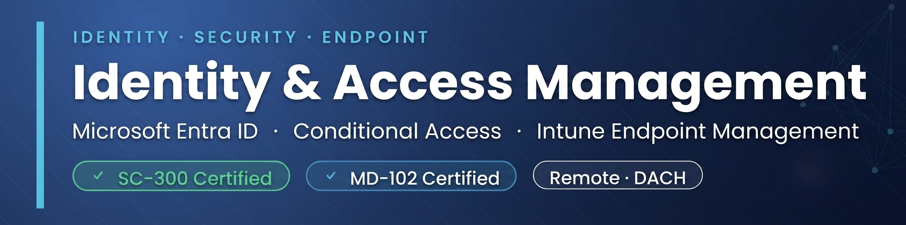

  

I specialize in **Identity & Endpoint Security** with a focus on Microsoft Entra ID, Conditional Access, and Intune Endpoint Management. 

My goal is simple: ensure only compliant devices and verified users get access to company resources — strictly based on **Zero Trust** principles.

---

### 🛠️ What I Do

* **Identity & Access:** Microsoft Entra ID, Conditional Access, Zero Trust Architectures
* **Endpoint Management:** Intune (Windows, macOS, Android, iOS), Compliance Policies
* **Mobile Security:** BYOD setups via App Protection Policies (MAM)
* **Strategy & Delivery:** 10+ years of experience as a digital agency founder. I bridge the gap between technical execution and business decisions.

---

### 📜 Certifications & Specs

* **SC-300** Identity and Access Administrator
* **MD-102:** Microsoft Endpoint Administrator
* **Android Enterprise Certified Expert**

---

### 🌐 Contact & Info

* **Location / Work:** Fully remote | Available for scoped projects across the DACH region
* **Connect:**  

---

### 📊 GitHub Stats

  
  

  

---

  

